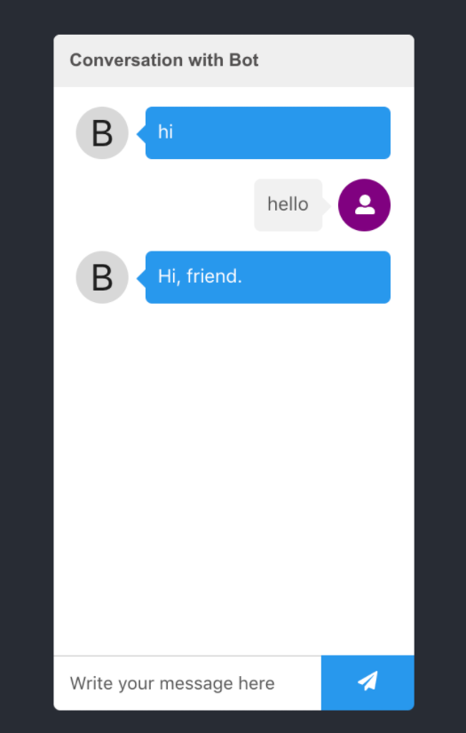

<h2>React Chat Bot</h2>

<pre>
  * React, React Hook, Jest
</pre>

<h3>:gear: Getting started</h3>

1. Clone project.
2. Install required dependencies with `yarn install`. 
3. Unit test using `yarn test` command
4. Run project using `npm start` command
5. Deploy on github-pages using `yarn build` command.